# Backstage Internal Developer Platform (IDP)

A self-service Internal Developer Platform built with [Backstage](https://backstage.io): a software catalog with live Kubernetes and ArgoCD status, software templates for self-service scaffolding, TechDocs, and ownership-based access control. Everything runs locally on one Ubuntu machine using only free and open-source tools.

## Architecture

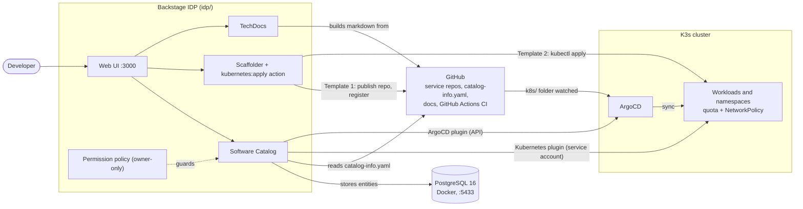

Developers work only through Backstage. It stores catalog data in PostgreSQL, reads service metadata and docs from GitHub, shows live pod status from K3s, and shows deployment status from ArgoCD, which itself syncs the cluster from Git.

| Layer | Choice |
|---|---|
| Portal | Backstage app in `idp/` (Node 22, Yarn 4.13) |
| Database | PostgreSQL 16 in Docker, port 5433, `--restart unless-stopped` |
| Cluster | K3s single node (v1.36) |
| GitOps | ArgoCD v3.5 with automated sync |
| SCM / CI | GitHub, GitHub Actions |
| Docs | TechDocs (local builder, `runIn: docker`) |

## Repository layout

```text
backstage-idp-platform/
├── README.md
├── LICENSE
├── docs/
│   └── screenshots/                        # evidence images used in this README
└── idp/                                    # the Backstage app
    ├── app-config.yaml                     # catalog locations, Kubernetes, ArgoCD, TechDocs, DB
    ├── package.json
    ├── .env                                # secrets (git-ignored, not in the repo)
    ├── examples/
    │   ├── entities.yaml                   # sample entities from the scaffold
    │   ├── org.yaml                        # groups guests / payments-team / platform-team + guest user
    │   └── template/template.yaml          # default example template from the scaffold
    ├── templates/
    │   ├── new-microservice/               # Template 1
    │   │   ├── template.yaml
    │   │   └── content/
    │   │       ├── main.py                 # FastAPI app (/ and /health)
    │   │       ├── requirements.txt
    │   │       ├── Dockerfile              # slim image, non-root user
    │   │       ├── catalog-info.yaml       # auto-registers the new service
    │   │       └── .github/workflows/ci.yaml   # GitHub Actions pipeline
    │   └── new-k8s-environment/            # Template 2
    │       ├── template.yaml
    │       └── content/k8s-environment.yaml    # Namespace + ResourceQuota + NetworkPolicy
    └── packages/
        ├── app/src/
        │   ├── App.tsx                     # frontend features (catalog, nav, home, ArgoCD plugin)
        │   └── modules/                    # nav and home modules
        └── backend/src/
            ├── index.ts                    # backend plugins (catalog, scaffolder, kubernetes, argocd, permission)
            └── modules/
                ├── k8sApplyModule.ts       # custom scaffolder action: kubernetes:apply
                └── permissionPolicy.ts     # owner-only permission policy
```

Key files only. The three service repos live in their own repositories: each holds its own `catalog-info.yaml`; ecommerce and autoscaling also hold the TechDocs sources, and autoscaling holds the `k8s/` folder that ArgoCD watches.

## 1. Service catalog

Three existing services from earlier tasks are registered through `catalog-info.yaml` files in their own repos (declared as `type: url` locations in `app-config.yaml`):

| Component | Repo | Owner | Type |
|---|---|---|---|
| ecommerce-order-processing-system | sonujha78/ecommerce-order-processing-system | payments-team | service |
| fraud-detection-pipeline | sonujha78/Fraud-Detection-Pipeline | guests | service |
| autoscaling-web-platform | sonujha78/autoscaling-web-platform | platform-team | service |

Each entry declares owner, type, lifecycle, system, `dependsOn`, a GitHub link, and the `backstage.io/kubernetes-id` annotation that ties it to its pods. Newly scaffolded services (for example `demo-payment-service`) register themselves automatically.

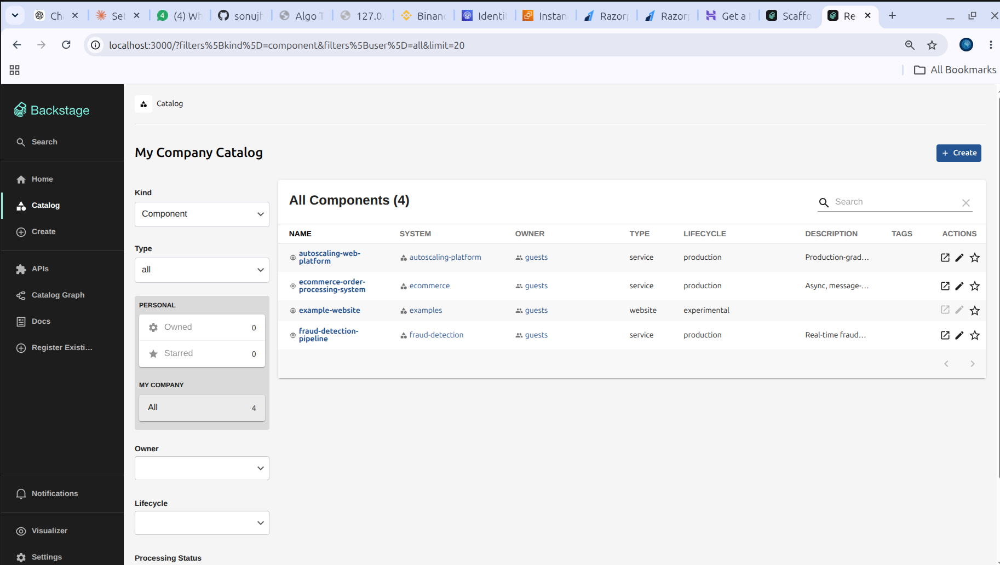

**Live Kubernetes health.** The Kubernetes plugin talks to K3s through a dedicated service account, and each component page shows pod status without any `kubectl`.

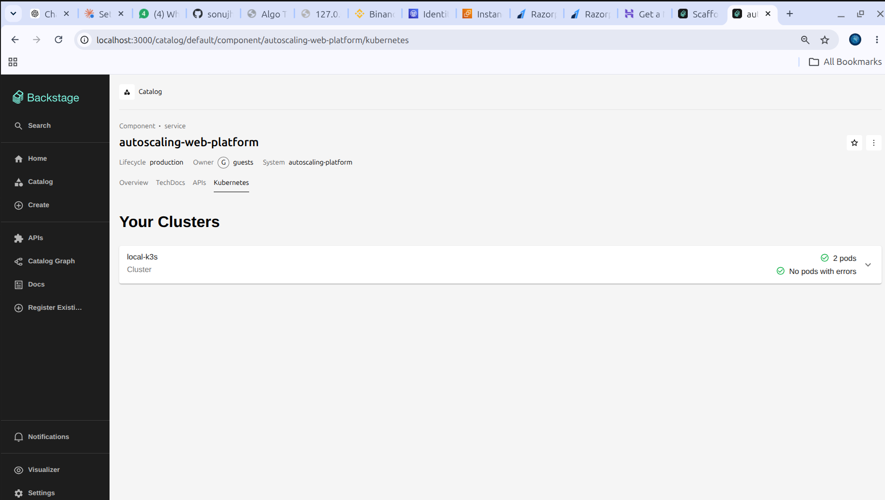


> Note: the pods behind ecommerce and fraud are placeholder `nginx:alpine` deployments carrying the `backstage.io/kubernetes-id` label. They exist to demonstrate the plugin end to end. The real applications from the earlier tasks run elsewhere (docker-compose, AWS).

## 2. Software templates

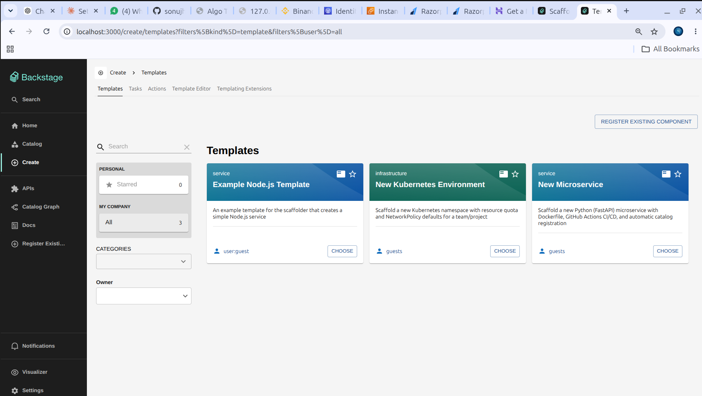

### Template 1: New Microservice

A form takes service name, owner, and language (Python/FastAPI), then:

1. `fetch:template` renders a FastAPI app (`/`, `/health`), `requirements.txt`, and a Dockerfile that follows the org standard (slim base image, non-root user).
2. It also renders `.github/workflows/ci.yaml` (GitHub Actions: install, build Docker image) and a `catalog-info.yaml`.
3. `publish:github` creates the repository and pushes the code.
4. `catalog:register` registers the new component in the catalog.

Proof: running it with `demo-payment-service` created the real repository `sonujha78/demo-payment-service` and registered it automatically.

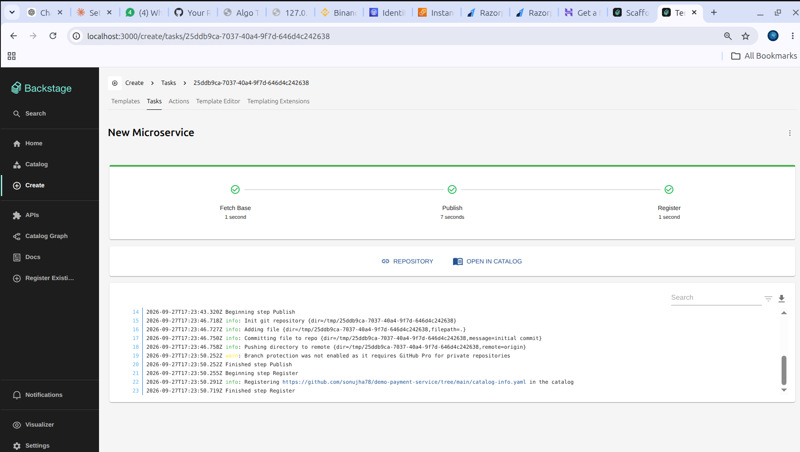
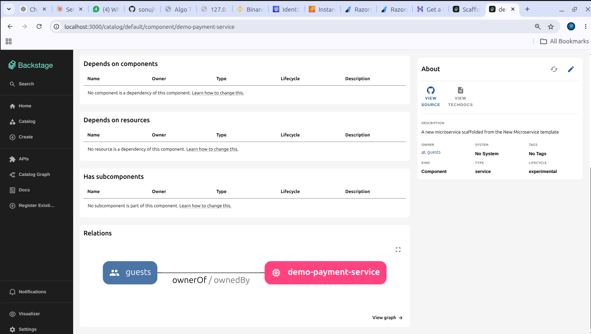

### Template 2: New Kubernetes Environment

A form takes team name (validated `^[a-z0-9-]+$`), CPU, memory and max pods (defaults 2 / 2Gi / 10). It renders one manifest containing a Namespace, a ResourceQuota, and a default-deny NetworkPolicy (traffic allowed only inside the team's namespace plus DNS egress), then applies it with a custom scaffolder action, `kubernetes:apply` (`k8sApplyModule.ts`), which runs `kubectl apply`.

Proof: running it for `demo-team` created real cluster objects.

~~~
$ kubectl get namespace demo-team
NAME        STATUS   AGE
demo-team   Active   49s
$ kubectl get resourcequota -n demo-team
NAME              REQUEST                                                 LIMIT
demo-team-quota   pods: 0/10, requests.cpu: 0/2, requests.memory: 0/2Gi   limits.cpu: 0/2, limits.memory: 0/2Gi
$ kubectl get networkpolicy -n demo-team
NAME                     POD-SELECTOR   AGE
demo-team-default-deny   <none>         49s
~~~

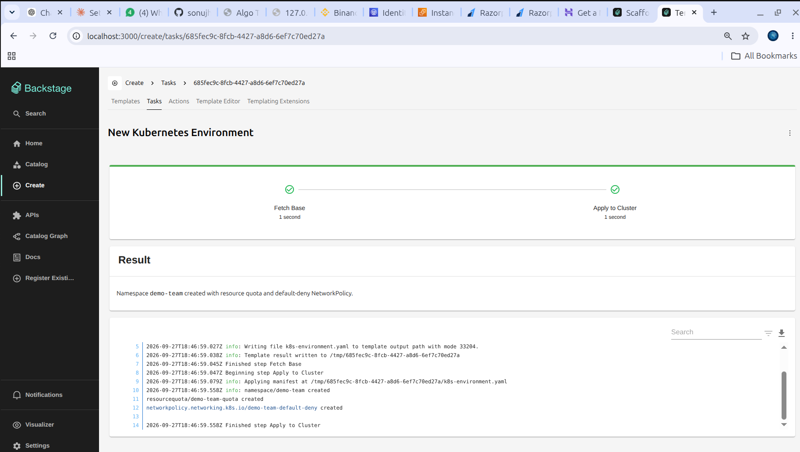

## 3. TechDocs

`mkdocs.yml`, `docs/index.md` and the `backstage.io/techdocs-ref: dir:.` annotation were added to two service repos. Each doc covers architecture, how to run locally, and how to deploy. Backstage builds and renders them from the repo.

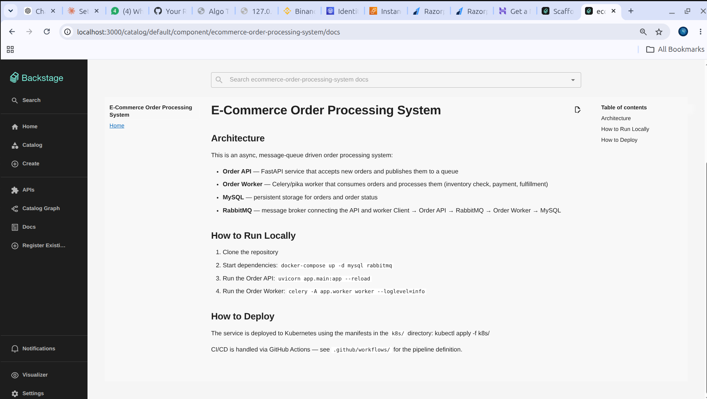
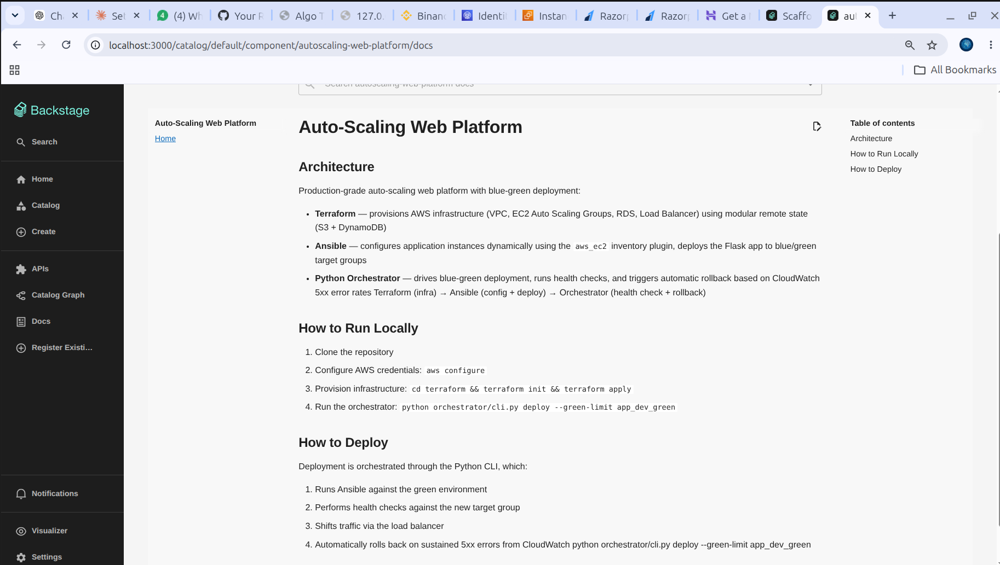

## 4. Deployment visibility (ArgoCD)

ArgoCD is installed in the K3s cluster. The application `autoscaling-web-platform` tracks the `k8s/` folder of the service repo with automated sync. The Backstage ArgoCD plugin (`@backstage-community/plugin-argocd` and its backend) shows the status on the component page under Deployment > Deployment Summary.

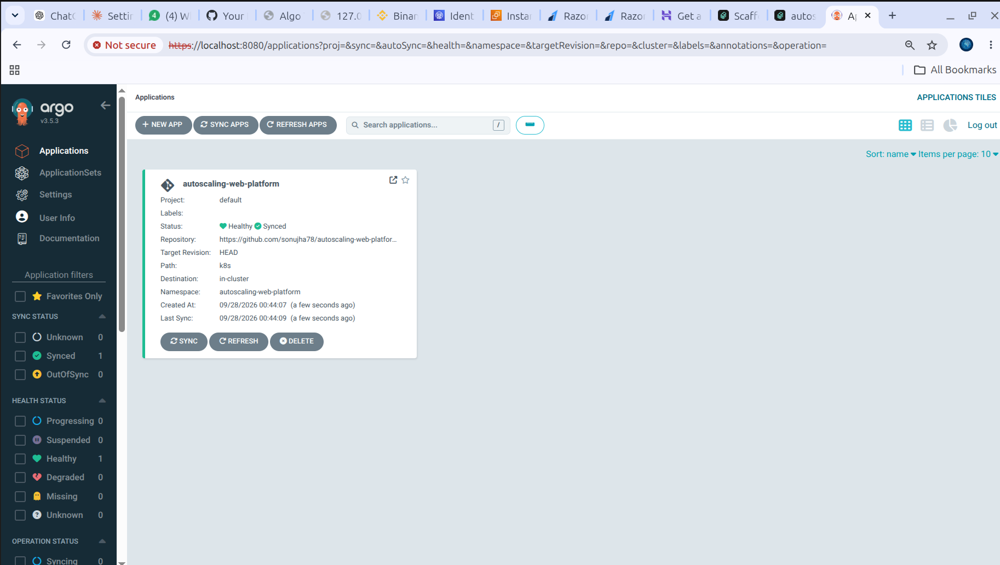
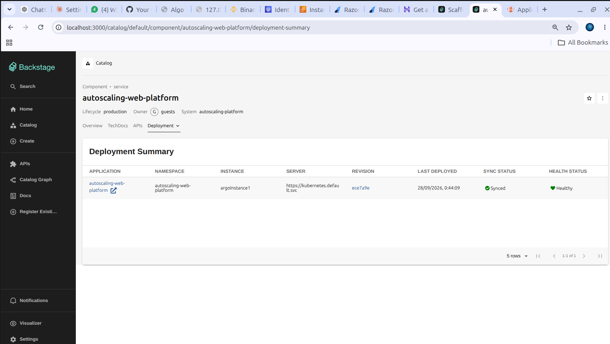

Proof of the GitOps loop: a Git push changed `replicas: 2` to `replicas: 3` in `k8s/deployment.yaml`. ArgoCD synced it, a third pod appeared (12 seconds old right after), and Backstage showed the new revision (`ece7a9e` to `87c45cc`), a new last-deployed time, Synced and Healthy, all without opening the ArgoCD UI.


## 5. Access control and ownership

Groups `payments-team` and `platform-team` were added next to `guests`; the `guest` user is a member of `guests` and `payments-team`, but not of `platform-team`. The two services were assigned to different teams.

A custom permission policy (`permissionPolicy.ts`) replaces allow-all: unregistering or refreshing a catalog entity is allowed only for its owning team (Backstage `isEntityOwner` condition evaluated against the user's ownership claims); everything else stays open. A `payments-team` member sees refresh and unregister on the ecommerce service, while the platform-team service is restricted.

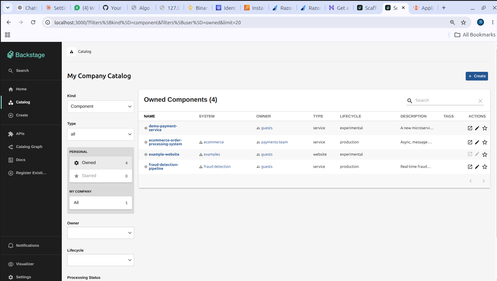
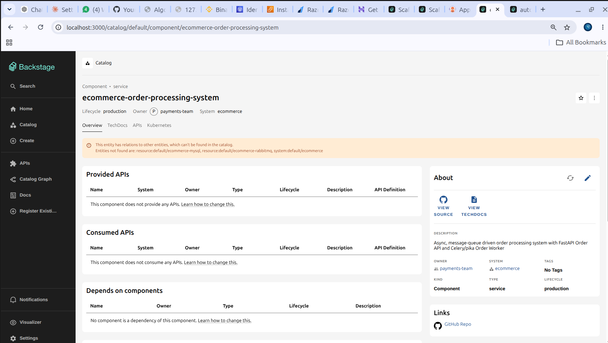
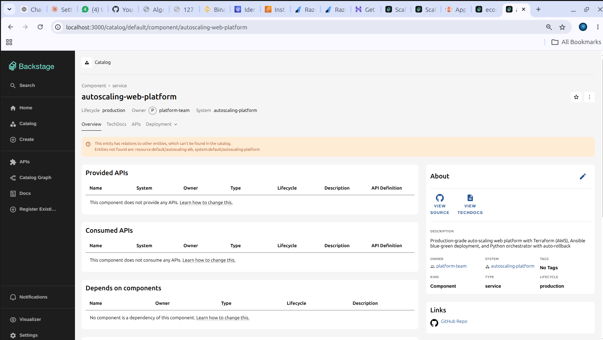

## 6. Issues hit and how they were fixed

| Problem | Cause | Fix |
|---|---|---|
| Postgres container failed to start | Host port 5432 already in use | Mapped to 5433 |
| Backend crashed at startup | `plugin-kubernetes-backend` registered twice | Removed the duplicate line |
| Catalog showed only the example component | The crash above meant the new config was never loaded | Fixed the crash, restarted |
| Custom scaffolder module failed to load | Module needed a default export; extension point is exported from the main package, not `/alpha` | Added `export default`, fixed the import |
| Template publish failed | GitHub PAT lacked the `workflow` scope needed to push `.github/workflows` | Added the scope |
| ArgoCD CRD apply failed | Annotation too long for client-side apply | Re-applied with `--server-side` |
| ArgoCD plugin returned 500 (`fetch failed`) | Node rejected ArgoCD's self-signed certificate | `NODE_TLS_REJECT_UNAUTHORIZED=0` for local dev |
| Ownership showed nothing | Guest identity is `user:development/guest`, so the user entity needed that namespace | Created the user in the `development` namespace |

## 7. Limitations and what production would need

- **Scaffolder is not owner-restricted.** Only catalog actions (unregister, refresh) are limited to the owning team. A template is not tied to one service, so "only payments can scaffold changes to payments" needs template-level rules or per-team templates.
- **Authentication is the guest provider**, which is for development only. Real SSO (GitHub/OIDC) is needed so group membership comes from a real identity.
- **The policy reads `user.info`**, which the installed plugin marks deprecated; it should move to the credentials-based API.
- **The Kubernetes service account is `cluster-admin`** for simplicity. Production needs a narrowly scoped read-only role.
- **`kubernetes:apply` uses the backend host's kubeconfig.** Production would apply through ArgoCD or a scoped identity instead.
- **TLS verification is disabled** for the local ArgoCD connection, and the ArgoCD token came from the session API, which expires. Production needs a proper certificate and a dedicated API token account.
- Some `dependsOn` resources and systems referenced in `catalog-info.yaml` are not defined in the catalog and show as warnings.

## 8. Why Platform Engineering and an IDP

Without a platform, every new service, database or environment is a ticket to the DevOps team. The platform team becomes a queue: developers wait days for something that is mostly identical each time, and the platform engineers spend their time repeating manual work instead of improving the system.

Without a shared path, every team also builds things slightly differently: different Dockerfiles, different CI, different namespace names, missing resource limits and network policies. Nobody decided that; it is what happens when each team copies whatever it last saw. Security and cost problems then live in the gaps between those variations.

The knowledge is tribal too. Who owns this service, where is its dashboard, how do I run it locally, how is it deployed: the answers sit in someone's head, an old wiki, or a Slack thread. New joiners and on-call engineers pay for that every time.

An IDP addresses all three. Templates turn the standard way of doing things into a form (a "golden path"), so the secure and compliant option is also the easiest one: naming, non-root containers, quotas and default-deny network policies are baked in and nobody has to remember them. The catalog gives every service a single page with owner, repo, docs, live pod health and deployment status, so questions have one place to be answered. Ownership rules add governance without a human approval step. Developers get self-service and speed; the platform team keeps control of the standards, and moves from doing tickets to building the product that removes them.

The caveat, and the reason this is a product and not a project: an IDP only works if developers actually adopt it, so it has to be treated with a product mindset (user feedback, documentation, measuring lead time and time to first deploy).

## Running it locally

Directory: `idp/` with Node 22 and Yarn.

~~~
docker start backstage-postgres      # PostgreSQL on 5433
kubectl port-forward svc/argocd-server -n argocd 8080:443   # separate terminal
export $(cat .env | xargs) && yarn start
~~~

Open http://localhost:3000.
